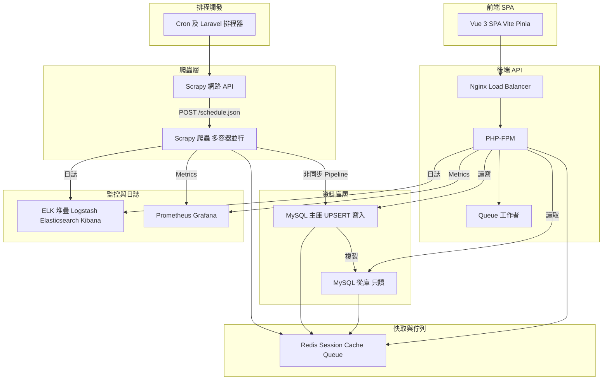

# Finance Aggregator 金融資訊聚合平台

**Finance Aggregator** 是一套端到端的金融數據聚合解決方案，結合 Scrapy 爬蟲、自動 UPSERT 機制、Laravel RESTful API 與 Vue 3 互動式前端，一鍵部署即可取得台股、匯率與新聞等多源金融資訊。

---

## 亮點

- **一鍵容器化部署**：Docker Compose 管理 MySQL、Laravel、Scrapy 爬蟲與 Vue 3 前端  
- **高效 UPSERT 機制**：Scrapy Pipeline 使用非同步連線池，避免重複寫入  
- **完整 RESTful API**：Laravel 10 + PHP 8.2 提供 Stocks、ExchangeRates、News 等端點  
- **互動式前端**：Vue 3 + Vite + Pinia 建置 SPA，支援分頁、列表與詳情視圖  
- **全面測試保障**：PHPUnit、PyTest、Vitest 與 Cypress 四大框架  
- **自動化 CI/CD**：GitHub Actions 驗證測試、Lint、映像建置，並可根據分支自動部署  

---

## 關鍵技術棧

| 模組              | 技術                  | 說明                                |
|-------------------|-----------------------|-------------------------------------|
| 爬蟲（crawler）   | Python 3.11 + Scrapy  | 非同步抓取台股、匯率、新聞並 UPSERT  |
| 資料庫（db）      | MySQL 8               | 支援 UPSERT、歷史資料、索引優化      |
| 後端（API）       | Laravel 10 + PHP 8.2  | RESTful API + Blade 儀表板           |
| 前端（SPA）       | Vue 3 + Vite + Pinia  | 單頁應用：列表、分頁、詳情           |
| 容器化（orchestrator） | Docker Compose   | 服務啟動、網絡管理                   |
| CI/CD             | GitHub Actions        | 自動跑測試、建置 Docker 映像         |

---

## 效能優化策略

- 架構層面  
  - 採用 Kubernetes 水平自動擴展（HPA）動態增減爬蟲容器、API 服務或工作者節點。  
  - 在資料庫前面部署 MySQL Proxy 進行負載均衡與連線池管理。

- 資料庫層面  
  - 建立必要索引並定期重建以加快查詢速度。  
  - 採用分庫分表或 Sharding 來分散寫入壓力。  
  - 只對熱點資料使用專門快取，再利用 Redis Cluster 實現分片與高可用。

- 快取與佇列  
  - Redis 採用 Cluster 模式，將熱門 Key 分散到多個節點。  
  - 使用管線（pipeline）批次執行命令以降低網路往返成本。

- 後端 API  
  - 在 Nginx 層開啟 gzip 壓縮和 HTTP2 加速，搭配限流和熔斷策略。  
  - PHP 或 Worker 採用連線池管理，減少頻繁開關 DB 連線的成本。

- 前端 SPA  
  - 靜態資源上傳至 CDN 邊緣節點，並設定合理的快取失效。  
  - 採用資源壓縮、Tree-shaking、Lazy load 減少初次載入時間。

- 監控與回溯  
  - 導入 APM （應用效能監控）工具做分散式追蹤，快速定位瓶頸。  
  - 持續收集 Metrics，設定告警，並以 Grafana 視覺化趨勢。

---

## 系統架構



---

## 快速上手

1. 複製環境變數  
   ```bash
   cp .env.example .env
   cp scrapy/.env.example scrapy/.env
   cp vue-frontend/.env.example vue-frontend/.env
   ```

2. 一鍵啟動  
   ```bash
   docker compose up -d --build
   ```

3. 安裝依賴與遷移資料庫  
   ```bash
   docker compose exec app composer install
   docker compose exec app php artisan key:generate
   docker compose exec app php artisan migrate

   docker compose exec vue_frontend npm install
   ```

4. (可選) 手動觸發爬蟲  
   ```bash
   docker compose exec scrapy scrapy crawl tw_stock_spider
   ```

---

## 關鍵代碼範例

### 1. Scrapy Pipeline：DatabasePipeline（`scrapy_project/pipelines.py`）

```python
class DatabasePipeline:
    def __init__(self, db_settings):
        self.db_settings = db_settings
        # adbapi.ConnectionPool 建立非同步連線池
        self.dbpool = None

    def open_spider(self, spider):
        # Spider 啟動時開池
        self.dbpool = adbapi.ConnectionPool('pymysql', **self.db_settings)

    def process_item(self, item, spider):
        # 根據 item 類型分派異步寫入
        if isinstance(item, StockItem):
            self.dbpool.runInteraction(self._upsert_stock, item)
        elif isinstance(item, ExchangeRateItem):
            self.dbpool.runInteraction(self._upsert_exchange_rate, item)
        elif isinstance(item, FinancialNewsItem):
            self.dbpool.runInteraction(self._upsert_financial_news, item)
        return item

    def _upsert_stock(self, cursor, item):
        # UPSERT 股票主檔
        cursor.execute("""
            INSERT INTO stocks(symbol, name, price, `change`, updated_at)
            VALUES (%s, %s, %s, %s, %s)
            ON DUPLICATE KEY UPDATE
              price = VALUES(price),
              `change` = VALUES(`change`),
              updated_at = VALUES(updated_at)
        """, (item['symbol'], item['name'], item['price'], item['change'], item['updated_at']))
```

### 2. Laravel 控制器：TriggerCrawl（`app/Http/Controllers/Api/TestController.php`）

```php
public function triggerCrawl(Request $request)
{
    $type = $request->input('type');  // stocks | exchange-rates | news

    // 驗證類型
    if (!in_array($type, ['stocks','exchange-rates','news'])) {
        return response()->json(['error'=>'Invalid crawl type.'], 400);
    }

    $spider = match($type) {
      'stocks' => 'tw_stock_spider',
      'exchange-rates' => 'exchange_rate_spider',
      'news' => 'financial_news_spider',
    };

    $url = sprintf('http://%s:%s/schedule.json',
      env('SCRAPY_HOST','scrapy'), env('SCRAPY_PORT',6800));

    $resp = Http::post($url, ['project'=>'scrapy_project','spider'=>$spider]);
    if ($resp->successful()) {
        return ['status'=>'started','job_id'=> $resp->json('jobid')];
    }
    return response()->json(['status'=>'failed'], $resp->status());
}
```

### 3. Laravel REST API：StockController（`app/Http/Controllers/Api/StockController.php`）

```php
public function index()
{
    // 回傳所有股票
    return response()->json(Stock::all());
}

public function show(string $symbol)
{
    // 含歷史價格關聯
    $stock = Stock::where('symbol',$symbol)
                  ->with('history')
                  ->firstOrFail();
    return response()->json($stock);
}
```

### 4. Docker Compose 核心片段（`docker-compose.yml`）

```yaml
services:
  db:
    image: mysql:8.0
    environment:
      MYSQL_DATABASE: laravel_finance
      MYSQL_USER: laravel
      MYSQL_PASSWORD: secret
    healthcheck: 
      test: ["CMD", "mysqladmin","ping","-h","localhost"]
      retries: 10

  app:
    build: ./laravel
    depends_on:
      db:
        condition: service_healthy
    environment:
      DB_HOST: db
      APP_KEY: ''

  scrapy:
    build: ./scrapy
    depends_on:
      db:
        condition: service_healthy

  vue_frontend:
    build: ./vue-frontend
    ports: ["5173:5173"]
    depends_on:
      app:
        condition: service_started
```

---

## 測試指令

- **Laravel** (PHPUnit)  
  ```bash
  docker compose exec app php artisan test
  ```
- **Scrapy** (PyTest)  
  ```bash
  docker compose exec scrapy pytest
  ```
- **Vue**  
  - 單元 (Vitest): `docker compose exec vue_frontend npm run test:unit`  
  - E2E (Cypress): `docker compose exec vue_frontend npm run test:e2e:dev`  

---

## 授權與貢獻

- 授權：MIT License  
- 歡迎提交 Issue 與 PR，詳見 [CONTRIBUTING.md](./CONTRIBUTING.md)  

---

> 如需更完整的範例或新增模組，請參考各目錄底下完整檔案與註解。
